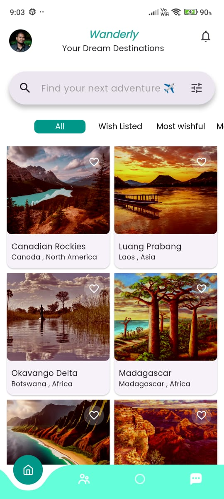
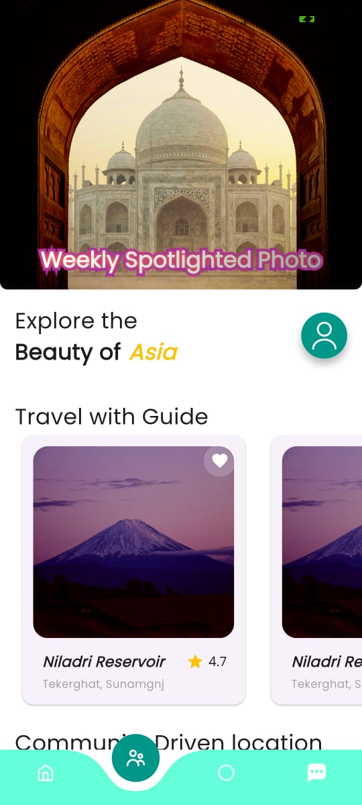

# Travel App

The **Travel App** is a sample Flutter application that helps users build and book trip itineraries. It’s a robust example with many features, routes, and screens. The app communicates with an HTTP server, supports both development and production environments, includes brand-specific styling, and has high test coverage. In these ways, it simulates a real-world, feature-rich Flutter application.

This project uses both **Bloc** and **Provider** for state management.

<br>

 



## 🚀 Running the App

```bash
flutter run
